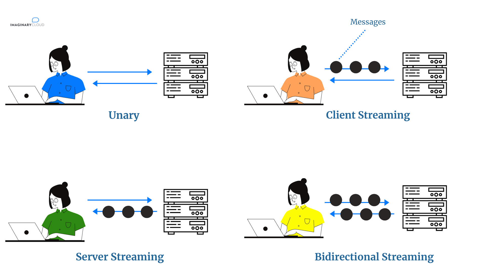

# Solution for streaming HTTP response

When 2 services communitate with each other, assumed services named A and B, there will be exist a case of max payload size limit. To bypass this case, [gRPC](https://grpc.io/) seems to be a good choice.

## What is gRPC?
Quoting the official [documentation](https://grpc.io/)

> “gRPC or Google Remote Procedure Call is a modern open-source high-performance RPC framework that can run in any environment. It can efficiently connect services in and across data centers with pluggable support for load balancing, tracing, health checking and authentication.”


## What is Protobuf

[Protocol Buffers](https://developers.google.com/protocol-buffers) (or protobuf)  is a high-performance, compact binary wire format invented by Google who use it internally so they can communicate with their internal network services at very high speed. It’s like JSON, except it's smaller and faster, and it generates native language bindings.

Protocol buffers are a combination of the definition language (created in .proto files), the code that the proto compiler generates to interface with data, language-specific runtime libraries, and the serialization format for data that is written to a file (or sent across a network connection).

Protocol buffers provide a serialization format for packets of typed, structured data that are up to a few megabytes in size. The format is suitable for both ephemeral network traffic and long-term data storage. Protocol buffers can be extended with new information without invalidating existing data or requiring code to be updated.

Protocol buffers are the most commonly-used data format at Google. They are used extensively in inter-server communications as well as for archival storage of data on disk.

Google says that protocol buffers are better than XML, as they are:

- simpler
- three to ten times smaller
- 20 to 100 times faster
- less ambiguous
- generates data access classes that make it easier to use them programmatically


## Why gRPC?

The gRPC framework is generally more efficient than using typical HTTP requests. gRPC is built on top of HTTP/2, which can make multiple requests in parallel on a long-lived connection in a thread-safe way. Connection setup is relatively slow, so doing it once and sharing the connection across multiple requests saves time. gRPC messages are also binary and smaller than JSON. Further, HTTP/2 has built-in header compression.

gRPC has built-in support for streaming requests and responses. It will manage network issues more gracefully than a basic HTTP connection, reconnecting automatically even after long disconnects. It also has interceptors, which you’ll learn about later in this tutorial. You can even implement plugins to the generated code, which people have done to output Python type hints. Basically, you get a lot of great infrastructure for free!

## Types of gRPC



- **Unary RPCs**: This is a simple gRPC which works like a normal function call. It sends a single request declared in the `.proto` file to the server and gets back a single response from the server.

- **Server streaming RPCs**: The client sends a message declared in the `.proto` file to the server and gets back *a stream of message sequence to read*. The client reads from that stream of messages until there are no messages.

- **Client streaming RPCs**: The client writes a message sequence using a write stream and sends the same to the server. After all the messages are sent to the server, the client waits for the server to read all the messages and return a response.

- **Bidirectional streaming RPCs**: Both gRPC client and the gRPC server use a read-write stream to send a message sequence. Both operate independently, so gRPC clients and gRPC servers can write and read in any order they like, i.e. the server can read a message then write a message alternatively, wait to receive all messages then write its responses, or perform reads and writes in any other combination.


## Implementation

** For the sake of simplicity, in this demo project, I use server streaming RPCs to response a large amount of text data back to the client using python's generators. But in the real situation it would be any kind of data like file content, database query results, etc.

We often have a case when querying a database to retrieve a large amounts of data (e.g. thousands or million records), this will take a lot of time querying and response to the end user. Instead we should split this data into chunks and stream these small pieces back to where the request came from. This will greatly improve performance.

```python
# client.py
# Client ask for book recommendations from a book store's website
...
request = recommendations_pb2.RecommendationRequest(user_id=1, max_results=max_results)
recommendations = self.stub.get_recommend_stream(request)

with open("recommend_books_from_server.txt", "w", encoding="utf-8") as fd:
    for recommend_book in recommendations:
        fd.write(f"{recommend_book.id}, {recommend_book.title}\n")
        print(recommend_book)
...
```

```python
# server.py
# The book store server, instead of sending all recommendations at one time,
# it splits these recommendations in pieces and send back to the client
...
max_results = request.max_results

for i in range(max_results):
    yield recommendations_pb2.BookRecommendation(id=i, title=fake.book())
...
```

Follow these instruction bellow to run this demo

1. Create virtual environment and install dependencies

    ```bash
    python -m venv venv
    source ./venv/bin/activate

    # update pip
    pip install pip -U

    # install depedencies
    pip install -r requirements.txt
    ```

2. Generate python code from `.proto` file

    ```bash
    chmod +x make_proto.sh
    ./make_proto.sh
    ```

3. To start the server tun the following command

    ```bash
    cd recommendations
    python server.py
    ```

4. To manually test the server you can run the default client by the following command

    ```bash
    cd recommendations
    python client.py
    ```

5. Then enter this url in your browser to trigger recommendation process

    ```
    http://localhost:3333/<numbers_of_book_to_be_recommended>
    ```

    After that you will see a lot of recommended books in your client's terminal. Also check `recommendations/recommend_books_from_server.txt` file to see what it recevied from the server.

With this streaming solution, you can send and receive large amounts of data between 2 services without worrying about the maximum payload limit.


## Load Test

Streaming load test is a litle bit harder to implement, so I will leave it for now. gRPC streaming is really useful for handling large amounts of data and for long run stream. For Unary gRPC, in real life test, the REST API still performs slightly better.

To run API load test with Locust, run `locust` command with appropiate parameters. In `locustfile.py`, adjust `max_results = 100_000` to reflect the number of records you want your API to return.

```bash
locust --users 10 --spawn-rate 2 --run-time 5m
```


## References

- https://grpc.io/
- https://www.velotio.com/engineering-blog/grpc-implementation-using-python
- https://docs.microsoft.com/en-us/aspnet/core/grpc/performance?view=aspnetcore-6.0
- https://blog.codeship.com/using-grpc-in-python/
- https://www.cloudbees.com/blog/exploring-security-metrics-and-error-handling-with-grpc-in-python
- https://www.imaginarycloud.com/blog/grpc-vs-rest/
- https://medium.com/@bimeshde/grpc-vs-rest-performance-simplified-fd35d01bbd4
- https://medium.com/drunk-wis/python-grpc-performance-test-with-locust-b57579cde436
- https://medium.com/nerd-for-tech/protobuf-what-why-fcb324a64564

